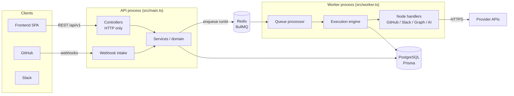
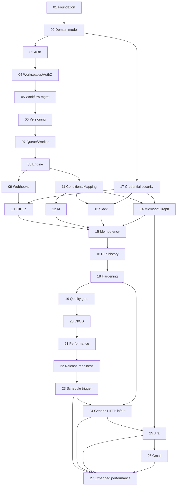

# FlowForge Backend Roadmap

Master plan and live status for the FlowForge backend. Each part has its own specification in this folder; this file tracks status and the rules for calling a part complete.

## Status Checklist

Legend: **NOT STARTED** (no meaningful implementation; stubs don't count) · **IN PROGRESS** (partial implementation exists or work is underway) · **COMPLETE** (meets the Definition of Done below, with evidence recorded in the part's file) · **BLOCKED** (cannot progress; reason stated).

| # | Part | Status | Notes (last reviewed 2026-09-30) |
| --- | --- | --- | --- |
| 01 | [Foundation and Infrastructure](01-FOUNDATION-AND-INFRASTRUCTURE.md) | COMPLETE | All 14 acceptance criteria verified 2026-09-30; CI green on GitHub (PR #1, `main`). Readiness startup race fixed in Part 03 |
| 02 | [Database Domain Model](02-DATABASE-DOMAIN-MODEL.md) | COMPLETE | All 8 acceptance criteria verified 2026-10-01; CI green incl. integration tests (PR #2, `main`) |
| 03 | [Authentication](03-AUTHENTICATION.md) | COMPLETE | All 10 acceptance criteria verified 2026-10-01; CI green on GitHub (PR #3, `main`) |
| 04 | [Workspaces and Authorization](04-WORKSPACES-AND-AUTHORIZATION.md) | COMPLETE | All 7 acceptance criteria verified 2026-10-01; CI green on GitHub (PR #4, `main`) |
| 05 | [Workflow Management](05-WORKFLOW-MANAGEMENT.md) | COMPLETE | All 8 acceptance criteria verified 2026-10-01; CI green on GitHub (PR #5, `main`) |
| 06 | [Workflow Versioning and Publishing](06-WORKFLOW-VERSIONING-AND-PUBLISHING.md) | COMPLETE | All 6 acceptance criteria verified 2026-10-01; CI green on GitHub (PR #6, `main`) |
| 07 | [Queue and Worker Infrastructure](07-QUEUE-AND-WORKER-INFRASTRUCTURE.md) | COMPLETE | All 8 acceptance criteria verified 2026-10-01; CI green on GitHub (PR #7, `main`) |
| 08 | [Workflow Execution Engine](08-WORKFLOW-EXECUTION-ENGINE.md) | COMPLETE | All 8 acceptance criteria verified 2026-10-01; CI green on GitHub (PR #7, `main`). Condition placeholder replaced in Part 11 |
| 09 | [Webhook Platform](09-WEBHOOK-PLATFORM.md) | COMPLETE | All 6 acceptance criteria verified 2026-10-01; signed intake, unique-delivery dedup (10 concurrent copies → 1 run), test provider. Not yet pushed/CI-verified |
| 10 | [GitHub Integration](10-GITHUB-INTEGRATION.md) | COMPLETE | All 6 acceptance criteria verified; AC-10.1 with real github.com events 2026-10-02 (issue #12 → run SUCCEEDED, label branch and mapped message). Fixed OAuth `code`/`state` in request logs. Not yet pushed/CI-verified |
| 11 | [Conditions and Data Mapping](11-CONDITIONS-AND-DATA-MAPPING.md) | COMPLETE | All 5 acceptance criteria verified 2026-10-01; nested AND/OR/NOT, 13 operators, templates; no code execution. Not yet pushed/CI-verified |
| 12 | [AI Integration](12-AI-INTEGRATION.md) | COMPLETE | All 6 acceptance criteria verified 2026-10-02; Anthropic provider + deterministic fake, summarize/classify/extract with zod validation and one repair, worker-only, external HTTP blocked in tests. Not yet pushed/CI-verified |
| 13 | [Slack Integration](13-SLACK-INTEGRATION.md) | COMPLETE | All 6 acceptance criteria verified 2026-10-02, incl. a real Slack workspace (flagship: GitHub issue → AI → HIGH → Slack message; LOW → none). Run queue now honours provider `Retry-After`. Not yet pushed/CI-verified |
| 14 | [Microsoft Graph Integration](14-MICROSOFT-GRAPH-INTEGRATION.md) | BLOCKED | Implemented; AC-14.1–14.4 and 14.6 verified 2026-10-02 (simulated Microsoft + live connect and refresh with a real Entra app). **Blocked on the manual part of AC-14.5:** creating a real To Do task needs an account with To Do (the test account is a guest without a mailbox) |
| 15 | [Idempotency and Side-Effect Safety](15-IDEMPOTENCY-AND-SIDE-EFFECT-SAFETY.md) | COMPLETE | All 10 acceptance criteria verified 2026-10-02; S1–S8 automated (incl. real hard-kill redelivery), claim fencing, manual retry with uncertain-outcome acknowledgement, "not sent" vs "maybe sent" classification. Not yet pushed/CI-verified |
| 16 | [Run History and Observability](16-RUN-HISTORY-AND-OBSERVABILITY.md) | COMPLETE | All 6 acceptance criteria verified 2026-10-02; run list/detail/steps/cancel, dashboard, error catalogue, correlation id on API → enqueue → every worker line, redaction on read. Not yet pushed/CI-verified |
| 17 | [Integration Credential Security](17-INTEGRATION-CREDENTIAL-SECURITY.md) | COMPLETE | All 7 acceptance criteria verified 2026-10-02; AES-256-GCM with AAD, key rotation CLI, shared redactor in storage/validator/logs, architecture test. Not yet pushed/CI-verified |
| 18 | [Rate Limiting and API Hardening](18-RATE-LIMITING-AND-API-HARDENING.md) | COMPLETE | All 7 acceptance criteria verified 2026-10-02; Redis-backed limits shared across instances (per user/IP/IP+email/provider), route authorization inventory, strict CSP/CORS, JSON-only bodies, provider timeouts, SSRF guard test, npm audit clean. Not yet pushed/CI-verified |
| 19 | [Testing and Quality Gate](19-TESTING-AND-QUALITY-GATE.md) | COMPLETE | All 6 acceptance criteria verified 2026-10-02; E2E journey + failure paths, unit thresholds (engine/expressions/validation/crypto ≥ 90 %), all-suite coverage 97.3 % (global floor 70 %, measured over all suites — documented deviation), CI gate in spec order, 3 consecutive green full runs. Fixed API-wide 500s when Redis is unavailable. Not yet pushed/CI-verified |
| 20 | [CI/CD and Containerization](20-CI-CD-AND-CONTAINERIZATION.md) | COMPLETE | Verified 2026-10-02 with Docker: one-shot migrate → healthy API + worker from one non-root image (491 MB, prod deps only), workflow run through the containers, graceful stop in 1.2 s, gitleaks clean; CI adds image build, Trivy (non-blocking), secret scan, per-run secrets. Green CI run (AC-20.4) to be recorded from the PR. **Part 22:** `main` CI was red after the merge (Trivy action unresolvable) — fixed in Part 22 |
| 21 | [Performance and Scalability](21-PERFORMANCE-AND-SCALABILITY.md) | COMPLETE WITH EXCEPTIONS | 1M-run EXPLAIN: hot queries are index scans; fixed a missing `retryOfRunId` index (18.7 s → 25 ms) and a non-sargable keyset cursor (295 → 1.9 ms); retention job, provider concurrency limits, backpressure 429, pool sizing. Webhook p95 38 ms alone, 1.76 s with workers on local disk (fsync-bound) — accepted for now |
| 22 | [Backend Release Readiness](22-BACKEND-RELEASE-READINESS.md) | COMPLETE WITH DEFERRALS | Audit of 21 areas (no FAIL), release checklist, OWASP walkthrough, IDOR probe 0/26, migration upgrade from the previous release, setup run from a clean clone (4 defects found and fixed), Swagger completed and enforced, CI Trivy breakage fixed; 902 tests green. Deferred: CI link (after push), live Microsoft task, live AI run |
| 23 | [Schedule / Time Trigger](23-SCHEDULE-TRIGGER.md) | IN PROGRESS | Implemented: schedule.trigger (7 kinds, IANA timezone), WorkflowSchedule, evaluator on the maintenance queue with SKIP LOCKED and a unique occurrence key; 30 unit and 15 integration tests green, including racing evaluators and a worker end-to-end run. Pending: CI run, live run on the dev stack |
| 24 | [Generic HTTP: Outbound Requests and Inbound Triggers](24-HTTP-REQUEST-AND-CUSTOM-API.md) | IN PROGRESS (all 3 slices implemented) | Egress guard, HTTP connections, `http.request`; generic webhook `webhook.received` (Scenario 4 green); `http.poll` (one run per new item, concurrent-safe). Before COMPLETE: CI run, live checks. Planned scope: `http.request` with SSRF egress guard and credential connections; robust generic webhook trigger (verification modes, replay protection, dedup, filters, limits, delivery log, test capture); `http.poll` trigger |
| 25 | [Jira Cloud Integration](25-JIRA-INTEGRATION.md) | IN PROGRESS | Implemented: 3LO connect (one connection per grant, site per node), shared OAuthTokenManager, 3 triggers via dynamic webhooks (signed URL + Atlassian JWT, per-connection routing), 7 actions, webhook sync/renewal with failure threshold, pickers; 13 unit and 23 integration tests green. Pending: real Jira Cloud E2E (AC-25.6) |
| 26 | [Gmail Integration](26-GMAIL-INTEGRATION.md) | NOT STARTED | Google OAuth, Pub/Sub push + history resolution, watch renewal, seven actions, email data minimisation |
| 27 | [Expanded-Platform Performance and Scalability](27-EXPANDED-PLATFORM-PERFORMANCE-AND-SCALABILITY.md) | NOT STARTED | Final validation of the expanded platform (schedules, HTTP, Jira, Gmail, multi-instance duplicate prevention); Part 21 remains the baseline |

Baseline at review time (commit `88b2fb5`): `npm run build` ✔, `npm run lint` ✔ (0 problems), `npm run typecheck` ✔, `npm test` ✔ (2 suites, 3 tests), `npm run test:e2e` ✔ (1 test), `prisma validate` ✔, `prisma migrate status` up to date. Redis container not running at review time.

## Project Purpose

FlowForge is a developer-focused workflow automation platform: a user connects accounts (GitHub, Slack, Microsoft, an AI provider), builds a small workflow graph (trigger → actions/conditions), publishes it, and FlowForge runs it reliably when events arrive.

It is a **portfolio-quality, production-style** system, not an n8n/Zapier clone. Scope is intentionally narrow — a handful of triggers and actions — so that the parts that matter (tenant isolation, immutable versions, idempotent webhooks, honest retry semantics, credential security, observability) can be done properly and demonstrated with tests.

Flagship workflow:

```
GitHub Issue Created → AI Classify → Priority HIGH? ─ yes → Slack Message
                                                    └ no  → end
```

## Backend Architecture

One NestJS codebase, two processes, shared infrastructure module:



Layering (kept deliberately thin):

- **Controllers** — routing, DTO validation, guards, status codes. No business logic, no Prisma.
- **Services** — business rules; take `workspaceId` explicitly; use `PrismaService` directly (no generic repository layer). A dedicated store class is introduced only where it earns its keep (e.g. `RunStore` for the engine, `CredentialStore` for secrets).
- **Engine** — framework-light TypeScript (graph validation, expressions, execution) with Nest wrappers for DI.
- **Integrations** — provider modules implementing narrow contracts (connect flow, webhook adapter, node handlers).

## Major Modules

| Module | Responsibility | Part |
| --- | --- | --- |
| `config` | Env schema, typed config | 01 |
| `common` | Filters, guards, decorators, pipes, redaction | 01, 04, 17 |
| `database` (Prisma) | Prisma client lifecycle | 01, 02 |
| `redis` | Shared Redis client | 01 |
| `health` | Liveness/readiness | 01 |
| `auth`, `users` | Local auth, tokens | 03 |
| `workspaces` | Tenancy, membership, roles | 04 |
| `workflows` | CRUD, drafts, publishing, versions | 05, 06 |
| `queue` | Queue contracts, dispatcher, sweeper | 07 |
| `engine` | Validation, execution, expressions, handler registry | 05, 08, 11 |
| `webhooks` | Generic intake pipeline | 09 |
| `integrations/*` | GitHub, Slack, Microsoft, AI | 10, 12–14 |
| `credentials` | Encryption, credential store, OAuth state | 17 |
| `runs`, `dashboard` | History, retry/cancel, summaries | 16 |

## Execution Architecture

1. A trigger (webhook, manual API call, retry) is validated in the API.
2. The API persists a `WorkflowRun` (`QUEUED`) bound to the workflow's **active immutable version**, with an idempotency key, in one transaction.
3. After commit, the API enqueues `{ runId }` with `jobId = runId` and responds `202`. A sweeper re-enqueues runs left `QUEUED` if enqueue failed.
4. A worker claims the run (`QUEUED → RUNNING` conditional update), loads the version snapshot, and walks the graph, persisting a `StepRun` before and after each node.
5. Handlers declare their side-effect class; retryable errors re-queue the job with backoff and resume from the failed step; uncertain outcomes of non-idempotent calls are not retried automatically.
6. The run ends `SUCCEEDED`, `FAILED` or `CANCELLED` with categorised errors, correlated logs and inspectable history.

Guarantee: **at-least-once processing with deduplication at each boundary**; no exactly-once claim (see Part 15).

## Infrastructure

- PostgreSQL 17 (Docker Compose locally, host port 5433), Prisma migrations.
- Redis 7 with AOF persistence for BullMQ; `noeviction` policy.
- Docker image shared by API and worker; Compose `full` profile runs everything.
- GitHub Actions CI implementing the quality gate (Part 19/20).

## Security Principles

1. Authorization is enforced in the backend on every request; the frontend is untrusted.
2. Every tenant resource is scoped by `workspaceId` in the query itself; cross-tenant access returns 404.
3. Secure by default: every route requires authentication unless marked `@Public()`.
4. Third-party credentials are encrypted at rest, decrypted only in the worker/OAuth code paths, and never returned or logged.
5. Logs are structured and redacted; secrets, tokens and signatures never appear in logs or error bodies.
6. Webhooks are authenticated by signature, deduplicated by delivery ID, and never trigger synchronous side effects.
7. No arbitrary code execution: expressions are a closed, validated grammar.
8. Least privilege for every OAuth scope and GitHub App permission.
9. Limits everywhere: body sizes, pagination, workflow size, timeouts, rate limits.

## Testing Strategy

| Layer | Purpose | Infra |
| --- | --- | --- |
| Unit | Pure logic: validation, expressions, engine transitions, classification, crypto, redaction | none |
| Integration | Modules with real Postgres/Redis via Supertest; providers mocked at HTTP level | Docker Compose / CI services |
| E2E | Full journey API → queue → worker → run history | Postgres, Redis, in-process worker |
| Manual (recorded) | Real provider runs (GitHub, Slack, Microsoft, AI) | Test accounts |

Standing suites that every new route must join: **tenant-isolation suite** (Part 04) and **secret canary scans** (Part 17). Details in [Part 19](19-TESTING-AND-QUALITY-GATE.md).

## Next Phase: Platform Conventions for Parts 23–27

All new triggers and integrations converge on the existing concepts — no per-provider mini-frameworks:

```
Integration provider (capability: /integrations/providers, /node-types)
        ↓
Workspace connection (what THIS workspace connected; many per provider)
        ↓
Encrypted credentials (Part 17 envelope; tokens or structured secrets)
        ↓
Triggers (WorkflowTrigger / WorkflowSchedule / WorkflowWebhook / provider subscriptions)
        ↓
Durable WorkflowRun (QUEUED) → BullMQ → worker → existing execution engine
```

- **Capability vs connection:** `/node-types` answers "what can FlowForge execute"; workspace integration endpoints answer "what has this workspace connected". Never conflated.
- **Multi-tenancy:** every connection belongs to one workspace; credential lookups always include `workspaceId`; a node's `connectionId` from another workspace fails at publish and at execution (tenant-isolation suite).
- **Connection status:** `CONNECTED` / `NEEDS_ATTENTION` / `DISCONNECTED` plus a safe `statusReason` (`TOKEN_REVOKED`, `TOKEN_EXPIRED`, `APP_UNINSTALLED`, `PERMISSION_CHANGED`, `WATCH_RENEWAL_FAILED`, `AUTHENTICATION_FAILED`) — introduced in Part 24, used by all providers.
- **Background work:** periodic jobs (schedule evaluation, webhook/watch renewal, polling) run on the existing **maintenance queue** via BullMQ job schedulers in the worker; distributed correctness comes from PostgreSQL (unique keys, `SKIP LOCKED`, conditional updates), never from in-memory locks.
- **Duplicate prevention:** one run per schedule occurrence / poll item / mailbox message / webhook delivery, enforced by the unique `WorkflowRun(workspaceId, idempotencyKey)` and `WebhookDelivery(provider, deliveryId)` indexes.
- **Naming:** node types follow existing conventions (`github.issue.created`, `slack.sendMessage`): triggers `<provider>.<resource>.<event>`, actions `<provider>.<verbObject>`.

Product scenarios used as E2E acceptance across Parts 23–27:

| # | Scenario | Parts |
| --- | --- | --- |
| 1 | Daily operations: schedule weekday 07:00 → HTTP fetch → condition failures > 0 → Gmail report | 23, 24, 26 |
| 2 | Email triage: Gmail new support email → AI classify/extract → priority HIGH → Jira incident → Slack | 26, 25, 12, 13 |
| 3 | Engineering: GitHub issue/PR → condition/AI → Jira create/update → Slack | 10, 25, 13 |
| 4 | Universal API: generic webhook → HTTP request → condition → Jira/Gmail/Slack | 24 (+25/26) |
| 5 | Periodic reporting: schedule Friday 16:00 → Jira search → AI summarise → Gmail | 23, 25, 12, 26 |

## Developer Experience and Deployment

- API and worker stay **separate processes** (`src/main.ts`, `src/worker.ts`), independently deployable and horizontally scalable. The API never boots the worker.
- Recommended convenience for local development (to add in Part 23): `npm run dev` starting `start:dev` (API) and `worker:dev` (worker) side by side with a process runner (e.g. `concurrently`), clearly labelled output, both stopping together. Production remains `start:prod` and `worker:prod` as separate services.
- Target initial production shape (no Kubernetes required): HTTPS reverse proxy → FlowForge Web → FlowForge API (n instances) → PostgreSQL + Redis/BullMQ → FlowForge workers (n) → GitHub / Slack / Microsoft / Jira / Gmail / HTTP / AI. Public URLs needed for provider webhooks and Pub/Sub push.

## Definition of Done

A part is **COMPLETE** only when all of the following are true and recorded as evidence in that part's file:

- implementation exists for every deliverable in scope
- `npm run build` passes
- `npm run lint` passes (0 errors)
- `npm run typecheck` passes
- relevant automated tests pass (unit, integration, e2e as specified)
- migrations apply cleanly where the part changes the schema
- the part's security requirements are satisfied
- API behaviour has been verified against the spec (tests and/or recorded manual calls)
- documentation (spec, README, Swagger) reflects the implementation
- no known critical defect remains

Code existing is not evidence. A failed acceptance criterion keeps the part IN PROGRESS (or BLOCKED) and is listed explicitly.

## Implementation Order

1. **Foundation:** 01 → 02
2. **Identity & tenancy:** 03 → 04
3. **Workflow authoring:** 05 → 06
4. **Execution core:** 07 → 08 → 11
5. **Triggers:** 09 → 17 (encryption service + OAuth state, pulled forward) → 10
6. **Actions:** 12 → 13 → 14
7. **Reliability & operations:** 15 → 16 → 17 (completion/audit) → 18
8. **Quality & delivery:** 19 → 20 → 21 → 22
9. **Next phase — triggers & integrations (planned 2026-10-03):** 23 Schedule → 24 Generic HTTP (needs the scheduler for `http.poll`) → 25 Jira (introduces the shared provider-subscription/renewal pattern and the generalised OAuth token manager) → 26 Gmail (reuses both) → 27 Expanded-platform performance validation (runs last, against the full platform)

Parts 19 and 20 are advanced incrementally throughout (every part adds tests; CI grows with it); they are marked COMPLETE only at their turn. Per-workspace AI keys (BYOK) were discussed and are **parked** (product decision 2026-10-03); scenarios use the current AI steps.

## Dependency Map



| Part | Hard dependencies |
| --- | --- |
| 01 | — |
| 02 | 01 |
| 03 | 01, 02 |
| 04 | 02, 03 |
| 05 | 02, 04 |
| 06 | 02, 04, 05 |
| 07 | 01, 02, 06 |
| 08 | 06, 07 |
| 09 | 06, 07, 08 |
| 10 | 09, 17 (encryption/OAuth state) |
| 11 | 05, 08 |
| 12 | 08, 11 |
| 13 | 08, 11, 17 |
| 14 | 08, 11, 17 |
| 15 | 07–14 |
| 16 | 07, 08, 15 |
| 17 | 02 |
| 18 | 01, 03, 04, 09 |
| 19 | 01–16 |
| 20 | 01, 19 |
| 21 | 07–16, 20 |
| 22 | all |
| 23 | 06, 07, 08, 15, 16 |
| 24 | 09, 11, 15, 17, 18, 23 (`http.poll`) |
| 25 | 09, 10 (pattern), 14 (token manager to generalise), 15, 17, 18, 24 (`statusReason`) |
| 26 | 09, 15, 17, 18, 21 (retention), 24, 25 (subscriptions, renewal, token manager) |
| 27 | 21 (baseline/tooling), 23, 24, 25, 26 |

## Change Log

| Date | Change |
| --- | --- |
| 2026-09-30 | Roadmap and specifications 01–22 created; statuses set from repository inspection of commit `88b2fb5`. |
| 2026-09-30 | Part 01 implemented and verified → COMPLETE. Parts 19 and 20 advanced (test harness, CI services). Next: Part 02. |
| 2026-10-01 | Part 02 implemented and verified → COMPLETE. Integration test harness added (Part 19). Next: Part 03. |
| 2026-10-01 | CI confirmed green on GitHub for Parts 01–02. Part 03 implemented and verified → COMPLETE. Next: Part 04. |
| 2026-10-01 | Part 03 CI green on GitHub. Part 04 implemented and verified → COMPLETE; scaffold routes moved under `/workspaces/:workspaceId`. Next: Part 05. |
| 2026-10-01 | Part 04 CI green on GitHub. Part 05 implemented and verified → COMPLETE; fixed body-parser errors returning 500 (Part 01 code). Next: Part 06. |
| 2026-10-01 | Part 05 CI green on GitHub. Part 06 implemented and verified → COMPLETE. Next: Part 07. |
| 2026-10-01 | Part 06 CI green on GitHub. Parts 07 and 08 implemented and verified → COMPLETE. Next: Part 11 (completes conditions), then 09. |
| 2026-10-01 | Parts 07–08 CI green on GitHub. Part 11 implemented and verified → COMPLETE (extended with nested groups and more operators on request). Next: Part 09, then 10. |
| 2026-10-01 | Part 09 implemented and verified → COMPLETE. Next: Part 10. |
| 2026-10-02 | Part 10 implemented; all criteria verified except a real github.com event → BLOCKED until a GitHub App is registered. Added publish-time connection check (cross-workspace connection ids). Next: Part 12 (or 17 for credential encryption before Slack). |
| 2026-10-02 | Parts 09–11 CI green on GitHub (PR #8). Part 17 implemented and verified → COMPLETE (pulled forward before Slack). Next: Part 12 (AI) or 13 (Slack). |
| 2026-10-02 | Part 17 CI green (PR #9). Part 12 implemented and verified → COMPLETE. AI `text` also accepts `{ ref }` because Part 11 caps templates at 16 KB. Next: Part 13 (Slack). |
| 2026-10-02 | Part 12 merged (PR #10). Part 10 verified with the real GitHub App → COMPLETE; request logs now redact OAuth `code`/`state`. Next: Part 13 (Slack). |
| 2026-10-02 | Part 13 implemented and verified with a real Slack workspace → COMPLETE (flagship workflow works end to end). Run jobs now use a custom backoff that honours `Retry-After`. Next: Part 14 (Microsoft Graph) or 15 (idempotency). |
| 2026-10-02 | Parts 10 and 13 merged (PR #13, #16). Part 14 implemented (PKCE, locked refresh with rotation, To Do action); live connect/refresh verified → BLOCKED only on a real task creation with a To Do-capable account. |
| 2026-10-02 | Part 14 merged (PR #17). Part 15 implemented and verified → COMPLETE: fixed duplicate side effects under concurrent processing (fencing) and false failures after redelivery. Next: Part 16 (run history and observability). |
| 2026-10-02 | Part 15 merged (PR #18). Part 16 implemented and verified → COMPLETE; closed two cancellation races. Next: Part 18 (rate limiting and API hardening). |
| 2026-10-02 | Part 16 merged (PR #19). Part 18 implemented and verified → COMPLETE; dependency advisories fixed with scoped overrides; npm audit added to CI. Next: Part 19 (testing and quality gate). |
| 2026-10-02 | Part 18 merged (PR #20). Part 19 implemented and verified → COMPLETE; rate limiting now fails open when Redis is unavailable. Next: Part 20 (CI/CD and containerization). |
| 2026-10-02 | Part 20 implemented and verified locally with Docker → COMPLETE (CI link pending). Next: Part 21 (performance and scalability). |
| 2026-10-02 | Part 21 implemented and measured → COMPLETE WITH EXCEPTIONS (see spec). Next: Part 22 (release readiness) or frontend. |
| 2026-10-02 | Part 22 release audit → COMPLETE WITH DEFERRALS. Backend is a release candidate with documented limitations; next: frontend. |
| 2026-10-03 | Next phase planned (no implementation): Parts 23 Schedule trigger, 24 Generic HTTP (outbound + robust inbound triggers), 25 Jira, 26 Gmail, 27 Expanded-platform performance validation. Platform conventions, scenarios and developer-experience notes added. Per-workspace AI keys (BYOK) parked. |
