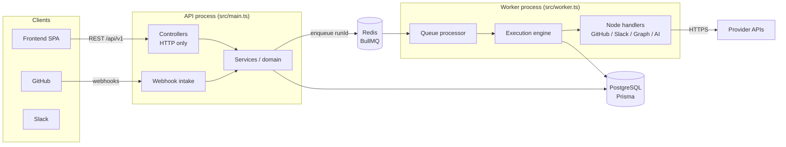
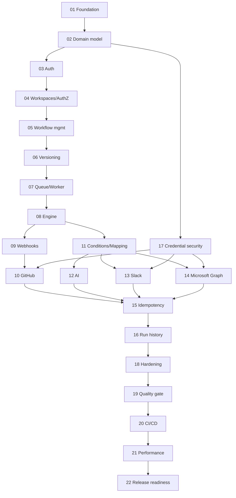

# FlowForge Backend Roadmap

Master plan and live status for the FlowForge backend. Each part has its own specification in this folder; this file tracks status and the rules for calling a part complete.

## Status Checklist

Legend: **NOT STARTED** (no meaningful implementation; stubs don't count) · **IN PROGRESS** (partial implementation exists or work is underway) · **COMPLETE** (meets the Definition of Done below, with evidence recorded in the part's file) · **BLOCKED** (cannot progress; reason stated).

| # | Part | Status | Notes (last reviewed 2026-09-30) |
| --- | --- | --- | --- |
| 01 | [Foundation and Infrastructure](01-FOUNDATION-AND-INFRASTRUCTURE.md) | COMPLETE | All 14 acceptance criteria verified 2026-09-30 (34 unit + 14 e2e tests, live server + production container checks). Updated CI workflow not yet run on GitHub |
| 02 | [Database Domain Model](02-DATABASE-DOMAIN-MODEL.md) | IN PROGRESS | Scaffold schema + `init` migration applied locally; doesn't meet spec (duplicate node/edge tables, one-run-per-delivery constraint, tokens on connection row, no refresh-token rotation fields) |
| 03 | [Authentication](03-AUTHENTICATION.md) | NOT STARTED | Controller/DTO stubs; service throws 501; guard rejects all non-public routes |
| 04 | [Workspaces and Authorization](04-WORKSPACES-AND-AUTHORIZATION.md) | NOT STARTED | Stubs only; `WorkspaceAccessGuard` always denies |
| 05 | [Workflow Management](05-WORKFLOW-MANAGEMENT.md) | NOT STARTED | Controller routes + stubs; validator throws 501 |
| 06 | [Workflow Versioning and Publishing](06-WORKFLOW-VERSIONING-AND-PUBLISHING.md) | NOT STARTED | Stub endpoints only |
| 07 | [Queue and Worker Infrastructure](07-QUEUE-AND-WORKER-INFRASTRUCTURE.md) | NOT STARTED | BullMQ queue registered and worker entrypoint exists; no job contracts, retries classification or tests |
| 08 | [Workflow Execution Engine](08-WORKFLOW-EXECUTION-ENGINE.md) | NOT STARTED | Contracts/registry skeleton; executor throws 501 |
| 09 | [Webhook Platform](09-WEBHOOK-PLATFORM.md) | NOT STARTED | Controller with raw body; service throws 501 |
| 10 | [GitHub Integration](10-GITHUB-INTEGRATION.md) | NOT STARTED | Provider stub |
| 11 | [Conditions and Data Mapping](11-CONDITIONS-AND-DATA-MAPPING.md) | NOT STARTED | Evaluator stub |
| 12 | [AI Integration](12-AI-INTEGRATION.md) | NOT STARTED | Service stub |
| 13 | [Slack Integration](13-SLACK-INTEGRATION.md) | NOT STARTED | Provider stub |
| 14 | [Microsoft Graph Integration](14-MICROSOFT-GRAPH-INTEGRATION.md) | NOT STARTED | Provider stub |
| 15 | [Idempotency and Side-Effect Safety](15-IDEMPOTENCY-AND-SIDE-EFFECT-SAFETY.md) | NOT STARTED | — |
| 16 | [Run History and Observability](16-RUN-HISTORY-AND-OBSERVABILITY.md) | NOT STARTED | Runs/dashboard stubs |
| 17 | [Integration Credential Security](17-INTEGRATION-CREDENTIAL-SECURITY.md) | NOT STARTED | Encryption stub; log redaction path list exists |
| 18 | [Rate Limiting and API Hardening](18-RATE-LIMITING-AND-API-HARDENING.md) | NOT STARTED | In-memory throttler with per-route limits on auth/webhooks |
| 19 | [Testing and Quality Gate](19-TESTING-AND-QUALITY-GATE.md) | IN PROGRESS | Unit + e2e configs and `createTestApp` helper established in Part 01; integration suite, factories, DB reset and E2E journey not started |
| 20 | [CI/CD and Containerization](20-CI-CD-AND-CONTAINERIZATION.md) | IN PROGRESS | Dockerfile, Compose (`full` profile; dev defaults + localhost ports added in Part 01), CI now has Postgres/Redis services + migrate step (unverified on GitHub). Missing: migrate service in Compose, audit, image build in CI, secret scan |
| 21 | [Performance and Scalability](21-PERFORMANCE-AND-SCALABILITY.md) | NOT STARTED | — |
| 22 | [Backend Release Readiness](22-BACKEND-RELEASE-READINESS.md) | NOT STARTED | — |

Baseline at review time (commit `88b2fb5`): `npm run build` ✔, `npm run lint` ✔ (0 problems), `npm run typecheck` ✔, `npm test` ✔ (2 suites, 3 tests), `npm run test:e2e` ✔ (1 test), `prisma validate` ✔, `prisma migrate status` up to date. Redis container not running at review time.

## Project Purpose

FlowForge is a developer-focused workflow automation platform: a user connects accounts (GitHub, Slack, Microsoft, an AI provider), builds a small workflow graph (trigger → actions/conditions), publishes it, and FlowForge runs it reliably when events arrive.

It is a **portfolio-quality, production-style** system, not an n8n/Zapier clone. Scope is intentionally narrow — a handful of triggers and actions — so that the parts that matter (tenant isolation, immutable versions, idempotent webhooks, honest retry semantics, credential security, observability) can be done properly and demonstrated with tests.

Flagship workflow:

```
GitHub Issue Created → AI Classify → Priority HIGH? ─ yes → Slack Message
                                                    └ no  → end
```

## Backend Architecture

One NestJS codebase, two processes, shared infrastructure module:



Layering (kept deliberately thin):

- **Controllers** — routing, DTO validation, guards, status codes. No business logic, no Prisma.
- **Services** — business rules; take `workspaceId` explicitly; use `PrismaService` directly (no generic repository layer). A dedicated store class is introduced only where it earns its keep (e.g. `RunStore` for the engine, `CredentialStore` for secrets).
- **Engine** — framework-light TypeScript (graph validation, expressions, execution) with Nest wrappers for DI.
- **Integrations** — provider modules implementing narrow contracts (connect flow, webhook adapter, node handlers).

## Major Modules

| Module | Responsibility | Part |
| --- | --- | --- |
| `config` | Env schema, typed config | 01 |
| `common` | Filters, guards, decorators, pipes, redaction | 01, 04, 17 |
| `database` (Prisma) | Prisma client lifecycle | 01, 02 |
| `redis` | Shared Redis client | 01 |
| `health` | Liveness/readiness | 01 |
| `auth`, `users` | Local auth, tokens | 03 |
| `workspaces` | Tenancy, membership, roles | 04 |
| `workflows` | CRUD, drafts, publishing, versions | 05, 06 |
| `queue` | Queue contracts, dispatcher, sweeper | 07 |
| `engine` | Validation, execution, expressions, handler registry | 05, 08, 11 |
| `webhooks` | Generic intake pipeline | 09 |
| `integrations/*` | GitHub, Slack, Microsoft, AI | 10, 12–14 |
| `credentials` | Encryption, credential store, OAuth state | 17 |
| `runs`, `dashboard` | History, retry/cancel, summaries | 16 |

## Execution Architecture

1. A trigger (webhook, manual API call, retry) is validated in the API.
2. The API persists a `WorkflowRun` (`QUEUED`) bound to the workflow's **active immutable version**, with an idempotency key, in one transaction.
3. After commit, the API enqueues `{ runId }` with `jobId = runId` and responds `202`. A sweeper re-enqueues runs left `QUEUED` if enqueue failed.
4. A worker claims the run (`QUEUED → RUNNING` conditional update), loads the version snapshot, and walks the graph, persisting a `StepRun` before and after each node.
5. Handlers declare their side-effect class; retryable errors re-queue the job with backoff and resume from the failed step; uncertain outcomes of non-idempotent calls are not retried automatically.
6. The run ends `SUCCEEDED`, `FAILED` or `CANCELLED` with categorised errors, correlated logs and inspectable history.

Guarantee: **at-least-once processing with deduplication at each boundary**; no exactly-once claim (see Part 15).

## Infrastructure

- PostgreSQL 17 (Docker Compose locally, host port 5433), Prisma migrations.
- Redis 7 with AOF persistence for BullMQ; `noeviction` policy.
- Docker image shared by API and worker; Compose `full` profile runs everything.
- GitHub Actions CI implementing the quality gate (Part 19/20).

## Security Principles

1. Authorization is enforced in the backend on every request; the frontend is untrusted.
2. Every tenant resource is scoped by `workspaceId` in the query itself; cross-tenant access returns 404.
3. Secure by default: every route requires authentication unless marked `@Public()`.
4. Third-party credentials are encrypted at rest, decrypted only in the worker/OAuth code paths, and never returned or logged.
5. Logs are structured and redacted; secrets, tokens and signatures never appear in logs or error bodies.
6. Webhooks are authenticated by signature, deduplicated by delivery ID, and never trigger synchronous side effects.
7. No arbitrary code execution: expressions are a closed, validated grammar.
8. Least privilege for every OAuth scope and GitHub App permission.
9. Limits everywhere: body sizes, pagination, workflow size, timeouts, rate limits.

## Testing Strategy

| Layer | Purpose | Infra |
| --- | --- | --- |
| Unit | Pure logic: validation, expressions, engine transitions, classification, crypto, redaction | none |
| Integration | Modules with real Postgres/Redis via Supertest; providers mocked at HTTP level | Docker Compose / CI services |
| E2E | Full journey API → queue → worker → run history | Postgres, Redis, in-process worker |
| Manual (recorded) | Real provider runs (GitHub, Slack, Microsoft, AI) | Test accounts |

Standing suites that every new route must join: **tenant-isolation suite** (Part 04) and **secret canary scans** (Part 17). Details in [Part 19](19-TESTING-AND-QUALITY-GATE.md).

## Definition of Done

A part is **COMPLETE** only when all of the following are true and recorded as evidence in that part's file:

- implementation exists for every deliverable in scope
- `npm run build` passes
- `npm run lint` passes (0 errors)
- `npm run typecheck` passes
- relevant automated tests pass (unit, integration, e2e as specified)
- migrations apply cleanly where the part changes the schema
- the part's security requirements are satisfied
- API behaviour has been verified against the spec (tests and/or recorded manual calls)
- documentation (spec, README, Swagger) reflects the implementation
- no known critical defect remains

Code existing is not evidence. A failed acceptance criterion keeps the part IN PROGRESS (or BLOCKED) and is listed explicitly.

## Implementation Order

1. **Foundation:** 01 → 02
2. **Identity & tenancy:** 03 → 04
3. **Workflow authoring:** 05 → 06
4. **Execution core:** 07 → 08 → 11
5. **Triggers:** 09 → 17 (encryption service + OAuth state, pulled forward) → 10
6. **Actions:** 12 → 13 → 14
7. **Reliability & operations:** 15 → 16 → 17 (completion/audit) → 18
8. **Quality & delivery:** 19 → 20 → 21 → 22

Parts 19 and 20 are advanced incrementally throughout (every part adds tests; CI grows with it); they are marked COMPLETE only at their turn.

## Dependency Map



| Part | Hard dependencies |
| --- | --- |
| 01 | — |
| 02 | 01 |
| 03 | 01, 02 |
| 04 | 02, 03 |
| 05 | 02, 04 |
| 06 | 02, 04, 05 |
| 07 | 01, 02, 06 |
| 08 | 06, 07 |
| 09 | 06, 07, 08 |
| 10 | 09, 17 (encryption/OAuth state) |
| 11 | 05, 08 |
| 12 | 08, 11 |
| 13 | 08, 11, 17 |
| 14 | 08, 11, 17 |
| 15 | 07–14 |
| 16 | 07, 08, 15 |
| 17 | 02 |
| 18 | 01, 03, 04, 09 |
| 19 | 01–16 |
| 20 | 01, 19 |
| 21 | 07–16, 20 |
| 22 | all |

## Change Log

| Date | Change |
| --- | --- |
| 2026-09-30 | Roadmap and specifications 01–22 created; statuses set from repository inspection of commit `88b2fb5`. |
| 2026-09-30 | Part 01 implemented and verified → COMPLETE. Parts 19 and 20 advanced (test harness, CI services). Next: Part 02. |
