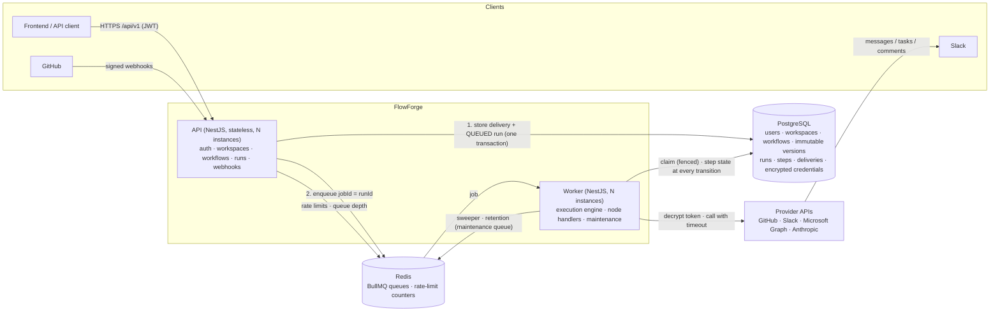

# 22 — Backend Release Readiness

**Status:** COMPLETE WITH DEFERRALS (2026-10-02) — audit, checklist and release documentation done; the release candidate has documented limitations; CI link, live Microsoft task and live AI run deferred (see below). See [00-BACKEND-ROADMAP.md](00-BACKEND-ROADMAP.md)

## Objective

Perform a final, evidence-based audit of the backend and produce the release documentation. The backend is not called production-ready because it builds; every critical requirement needs linked evidence.

## Why This Part Exists

It turns 21 parts of work into a verifiable claim, and makes limitations explicit rather than hidden.

## Scope

Audit across all areas, release checklist with evidence links, known limitations, technical debt, future improvements, security considerations, architecture diagram, capability and integration matrix, setup and troubleshooting guides.

## Functional Requirements

### Audit areas (each needs a verdict: PASS / PASS WITH LIMITATIONS / FAIL, and evidence)

Security · Reliability · Correctness · Testing · Database · Authentication · Authorization · Workspace isolation · Queues · Workers · Idempotency · Integrations (GitHub, Slack, Microsoft, AI) · Observability · Configuration · Docker · Documentation · API documentation (Swagger complete, examples, error responses) · Performance.

### Release checklist (minimum)

- [ ] All parts 01–21 COMPLETE per roadmap criteria, or explicitly deferred with rationale
- [ ] CI green on release commit (link)
- [ ] Migrations apply to empty DB and to previous release's DB
- [ ] Tenant-isolation suite covers every tenant route (route inventory test green)
- [ ] Reliability scenarios S1–S8 green
- [ ] Secret canary scans green (responses, logs, DB)
- [ ] `npm audit --audit-level=high` clean or exceptions documented
- [ ] Manual real-provider runs recorded (GitHub, Slack, Microsoft, AI)
- [ ] Swagger reviewed for every endpoint
- [ ] Setup guide executed from a clean clone by following it literally
- [ ] No known critical/high defects open

## Technical Requirements

- Evidence stored as links to CI runs, test files, command outputs and commit SHAs in this document.
- Architecture diagram (Mermaid) of API, worker, Postgres, Redis, providers and data flows.
- Security review includes: OWASP API Top 10 walkthrough, dependency review, secrets scan (gitleaks), manual IDOR probing.

## API Changes

None (documentation only).

## Database Changes

None.

## Security Requirements

Security considerations section covering: threat model summary (from Part 17), tenant isolation approach and residual risk (no RLS), token lifetimes, rate limits, AI prompt-injection residual risk, uncertain-outcome policy, operational key management.

## Testing Requirements

Execute the full CI gate on the release commit; execute setup guide from a clean clone; execute manual integration runs.

## Deliverables

This document completed with: audit table, release checklist with evidence, known limitations, technical debt, future improvements, security considerations, architecture diagram, supported workflow capabilities, supported integrations, setup instructions, troubleshooting guide. README updated to link it.

## Acceptance Criteria

| ID | Criterion | Verification |
| --- | --- | --- |
| AC-22.1 | Every audit area has a verdict and evidence | This document |
| AC-22.2 | Release checklist fully checked or items explicitly deferred | This document |
| AC-22.3 | Known limitations and technical debt listed honestly | Review |
| AC-22.4 | Setup guide works from clean clone | Recorded run |
| AC-22.5 | Troubleshooting guide covers common failures (DB/Redis down, webhook signature failures, OAuth callback mismatch, provider auth expired, stuck runs) | Review |

## Definition of Done

Common DoD in [00](00-BACKEND-ROADMAP.md#definition-of-done).

## Out of Scope

Frontend readiness, deployment to a hosted environment.

## Dependencies

All previous parts.

## Risks / Design Questions

The main risk is optimism bias: any area without evidence is FAIL, not PASS.

## Implementation Notes

Sections to be filled during the audit: Audit Results · Known Limitations · Technical Debt · Future Improvements · Security Considerations · Architecture Diagram · Supported Capabilities · Supported Integrations · Setup · Troubleshooting.

---

# Release readiness report

Audit performed 2026-10-02 on branch `feat/part-22-release-readiness` (based on `main` at `b16bb7a`, Part 21 merged). Evidence is a test file, a recorded command run, or a part specification's evidence section. **Verdict: release candidate with documented limitations** — ready to build the frontend against and to demo; not yet claimed production-ready, because the items under [Release checklist](#release-checklist) marked DEFERRED are open.

## Audit results

| Area | Verdict | Evidence |
| --- | --- | --- |
| Security | PASS WITH LIMITATIONS | [OWASP walkthrough](#owasp-api-security-top-10-walkthrough) below; gitleaks over the full history: 29 commits, no leaks (2026-10-02); `npm audit --audit-level=high`: 0 vulnerabilities; image scan (Trivy 0.69.3, pinned by digest): 0 HIGH/CRITICAL after removing the base image's unused npm (10 findings before, all in bundled npm); manual IDOR probe: 26 probes, 0 leaks. Limitation: no row-level security (see [Security considerations](#security-considerations)) |
| Reliability | PASS | Part 15: S1–S8 automated in `test/integration/reliability.int-spec.ts` (duplicate webhooks, three workers on one run, hard-kill redelivery, timeouts, manual retry, lost enqueue, transient DB errors); fencing tokens on run claims; graceful shutdown (Part 20: `docker stop` 1.2 s, no lost run) |
| Correctness | PASS | Engine unit suite (ordering, branches, resume, fencing, provider slots) `src/engine/execution/execution-engine.spec.ts`; E2E journey `test/e2e/journey.e2e-spec.ts`; real GitHub → AI-free → Slack runs (Parts 10, 13) |
| Testing | PASS | 65+ suites / 900+ tests across unit, integration and E2E; per-area unit thresholds ≥ 90 % (engine, expressions, validation, crypto); whole-system line coverage 97.2 % (floor 70 %). Final local gate result below. One intermittent failure observed in `scalability.int-spec.ts` (1 of 10 runs, see Part 21) |
| Database | PASS | Migrations apply to an empty DB (CI, test setup, perf stack) and **upgrade the previous release's DB**: 3 migrations of `6a8c221` + 2 000 seeded runs → `migrate deploy` applied `20261002120000_retention_and_indexes`, data intact, `migrate diff` against the schema: no drift (2026-10-02); 1M-run EXPLAIN in Part 21 |
| Authentication | PASS | Part 03: argon2id, 15 min access / 7 d refresh JWT with rotation and reuse detection (`auth.int-spec.ts`); login throttling (`auth-throttle.int-spec.ts`) |
| Authorization | PASS | Route access inventory: every served route has a reviewed expectation, a new route fails the test (`api-hardening.int-spec.ts`); role policy unit tests (`workspace-policy.spec.ts`) |
| Workspace isolation | PASS WITH LIMITATIONS | `tenant-isolation.int-spec.ts` discovers every workspace route and asserts 404 for non-members (indistinguishable from a missing workspace); manual probe 0/26 leaks; application-level scoping only (no RLS) |
| Queues | PASS | `jobId = runId`, DB-first enqueue + sweeper (Part 07), Retry-After-aware backoff (Part 13), backpressure 429 for manual runs (Part 21) |
| Workers | PASS | Horizontal: 2 workers × 100 runs exactly once (`scalability.int-spec.ts`); heartbeat health check (Part 20); per-provider concurrency limit (Part 21) |
| Idempotency | PASS | Delivery dedup by unique constraint (10 concurrent copies → 1 run), `Idempotency-Key` on manual runs and retries, side-effect classes with UNCERTAIN_OUTCOME (Part 15) |
| Integrations — GitHub | PASS | Real github.com issue → run SUCCEEDED (Part 10, 2026-10-02) |
| Integrations — Slack | PASS | Real Slack workspace: HIGH → message, LOW → none (Part 13) |
| Integrations — Microsoft | PASS WITH LIMITATIONS | Real Entra connect + token refresh/rotation verified; creating a real To Do task not verified (account without a mailbox) — Part 14 BLOCKED on that manual step |
| Integrations — AI | PASS WITH LIMITATIONS | Fake provider end-to-end + mocked Anthropic contract tests (Part 12); **never run against the live Anthropic API** (no key used) |
| Observability | PASS | Correlation id API → enqueue → every worker line, run history API, error catalogue, redaction on read (Part 16); secret canaries in logs/responses/DB (`canaries.ts`, `credentials.int-spec.ts`, journey) |
| Configuration | PASS | zod env schema, production rules (no placeholder secrets, no fake AI, throttling on, no wildcard CORS); found and fixed in this audit: `.env.example` failed validation as copied, and empty variables leaked through as `''` (see [Defects found](#defects-found-and-fixed-during-the-audit)) |
| Docker | PASS | Part 20 (non-root 491 MB image, migrate target, health checks, graceful stop); this audit: npm removed from the runtime image, blocking image scan |
| Documentation | PASS | README quick start executed from a clean clone (below); this report; per-part specs with evidence |
| API documentation | PASS WITH LIMITATIONS | 47 operations, each with a summary and documented error responses (shared `ErrorResponse` schema) — enforced by `test/integration/api-docs.int-spec.ts`. Limitation: 20 success responses are described in text but have no typed schema; no request/response examples beyond the error envelope |
| Performance | PASS WITH LIMITATIONS | Part 21: hot queries are index scans at 1M runs; webhook intake p95 38 ms at 50 req/s without concurrent workers, 1.76 s with workers on the same laptop disk (fsync-bound) |

### OWASP API Security Top 10 walkthrough

| Risk | Status | How |
| --- | --- | --- |
| API1 Broken object level authorization | Mitigated | Every query scoped by `workspaceId` from the membership guard; isolation suite + manual probe |
| API2 Broken authentication | Mitigated | argon2id, short access tokens, rotating refresh tokens with family revocation, login throttling per IP+email |
| API3 Broken object property level authorization | Mitigated | Explicit `select`s / response DTOs; `passwordHash` and credentials never selected into responses; whitelist validation (`forbidNonWhitelisted`) |
| API4 Unrestricted resource consumption | Mitigated | Redis rate limits per user/IP/provider, body limits (300 KB, 1 MB webhooks), definition size limits, node timeouts, backpressure 429 |
| API5 Broken function level authorization | Mitigated | `@RequireRole` + route access inventory test |
| API6 Unrestricted access to sensitive business flows | Partly | Register/login throttled; no CAPTCHA or email verification (limitation) |
| API7 SSRF | Mitigated | No user-supplied outbound URLs; provider base URLs come from config only (`no-outbound-urls.spec.ts`) |
| API8 Security misconfiguration | Mitigated | Strict CSP/helmet, CORS allow-list, Swagger off in production, production env rules |
| API9 Improper inventory management | Mitigated | Versioned `/api/v1`, route inventory test, Swagger with every operation |
| API10 Unsafe consumption of APIs | Mitigated | Provider responses validated (zod for AI), timeouts ≤ 30 s, size limits, Retry-After honoured, errors classified |

## Release checklist

| Item | Status | Evidence / rationale |
| --- | --- | --- |
| All parts 01–21 COMPLETE or explicitly deferred | DONE WITH DEFERRALS | Roadmap: 01–13, 15–20 COMPLETE; 14 BLOCKED on the manual To Do run (deferred: needs an outlook.com or licensed Microsoft 365 account); 21 COMPLETE WITH EXCEPTIONS (deferred items listed in its spec) |
| CI green on release commit | DEFERRED until push | `main` CI had been failing since the Part 20 merge (`6a8c221`, run 37049242400): `aquasecurity/trivy-action@0.28.0` no longer resolves. Fixed in this branch (Trivy image pinned by digest). The green run link is recorded when this branch's PR runs |
| Migrations apply to empty DB and previous release DB | DONE | Database row above |
| Tenant isolation covers every tenant route | DONE | `tenant-isolation.int-spec.ts` (route discovery) + `api-hardening.int-spec.ts` (inventory) |
| Reliability S1–S8 green | DONE | `reliability.int-spec.ts`, part of the gate below |
| Secret canary scans green | DONE | Logs/responses (`captureLogs` + `expectNoSecrets` in journey, runs, AI, Slack, Microsoft specs), DB at rest (`credentials.int-spec.ts`), git history (gitleaks) |
| `npm audit --audit-level=high` clean | DONE | 0 vulnerabilities |
| Manual real-provider runs | PARTLY | GitHub ✔, Slack ✔, Microsoft connect/refresh ✔ (task creation deferred), AI ✘ (deferred: needs an Anthropic key; run `AI_PROVIDER=anthropic` once before relying on AI steps) |
| Swagger reviewed for every endpoint | DONE WITH LIMITATIONS | `api-docs.int-spec.ts`; typed success schemas missing for 20 operations |
| Setup guide executed from a clean clone | DONE (after fixes) | [Recorded run](#setup-guide-recorded-run) |
| No known critical/high defects open | DONE | Defects found in this audit are fixed; open items are limitations, not defects |

## Defects found and fixed during the audit

| Defect | Impact | Fix |
| --- | --- | --- |
| CI `docker` job could not resolve `aquasecurity/trivy-action@0.28.0` | `main` CI red since Part 20; AC-20.4 never actually met | Trivy run as a container pinned by digest; scan made blocking (baseline 0) |
| Runtime image shipped the base image's npm (10 HIGH CVEs) | Avoidable attack surface | npm/npx/corepack/yarn removed from the runtime stage |
| npm ≥ 11 blocks dependency install scripts, so `npm install` no longer generates the Prisma client | Fresh clone: `start:dev` failed with 161 TypeScript errors | README: explicit `npx prisma generate` step |
| `.env.example` failed validation as copied (`GITHUB_APP_SLUG=` empty) | Fresh clone: API refused to start | Empty slug treated as unset; unit test validates `.env.example` as-is |
| ConfigService fell back to raw `process.env` for values validation had unset (e.g. `PROVIDER_CONCURRENCY=` → `''`) | Fresh clone: worker refused to start | `skipProcessEnv: true` (only validated values); regression test |
| `start:dev` and `worker:dev` both cleaned `dist/` | Running both (as the README says) raced: `EPERM rmdir` on Windows | Worker watch build goes to `dist-worker/` |
| Swagger: 35 of 47 operations without a summary, 21 without any error response, no error schema | Incomplete API docs for the frontend | Summaries on every handler, standard error responses + `ErrorResponse` schema, enforced by a test |

## Setup guide: recorded run

2026-10-02, `git clone` of `b16bb7a` into an empty directory, Node 22 / npm 11.19.1, following README "Quick start" literally. Only deviation: the developer's own stack occupies the default container names and ports, so Postgres/Redis ran as a separate Compose project on other ports (and `.env` pointed there).

1. `cp .env.example .env`, `docker compose up -d postgres redis`, `npm install` (1 min 58 s), `npx prisma migrate deploy` (4 migrations) — OK.
2. `npm run start:dev` — **failed**: Prisma client not generated (npm 11 skipped install scripts). Fixed: `npx prisma generate` step.
3. API then **refused to start**: `GITHUB_APP_SLUG: Invalid` from the copied `.env.example`. Fixed in the schema.
4. Starting API and worker together: **EPERM** on `dist/`. Fixed: separate worker output directory.
5. Worker **refused to start**: `limit must be a positive integer` (empty `PROVIDER_CONCURRENCY`). Fixed: validated config only.
6. With the fixes applied in the clone: `/health/ready` → `{"status":"ok", database up, redis up}`; worker started; smoke run register → workflow (`manual.trigger` → `util.log` with a template) → publish → run: **SUCCEEDED in 181 ms**, step output `hello clean clone`; IDOR probe 0/26 leaks; Swagger JSON served.

The clone and its containers/volumes were removed afterwards.

## Known limitations

- **Tenant isolation is application-level** (every query scoped by `workspaceId`, verified by tests); there is no PostgreSQL row-level security as a second line of defence.
- **Microsoft To Do** task creation not verified against a real mailbox; **AI** steps never run against the live Anthropic API.
- **Webhook latency under combined load** on a laptop disk (Part 21): intake shares the database's commit capacity with workers; measured p95 1.76 s at 50 req/s with workers running locally. Not re-measured on server storage.
- **No email verification, password reset or CAPTCHA**; accounts are email + password only.
- **Per-provider concurrency is per worker process**, not cluster-wide; the effective limit is workers × `PROVIDER_CONCURRENCY`.
- **Retention deletes webhook deliveries after 30 days**: a provider redelivering a >30-day-old delivery id would be accepted again (providers do not do this in practice).
- **Swagger**: 20 success responses lack typed schemas; few examples.
- **Single region, single database**; no read replicas or sharding (out of scope).
- The TEST webhook provider and `THROTTLE_ENABLED=false` exist for tests and load tests; both are refused in production.

## Technical debt

- 7 open Dependabot PRs (#21–#27): `actions/checkout`/`setup-node` v4 → v7 (Node 20 actions are deprecated on GitHub runners; #21/#22 failed only because of the Trivy action and should pass once this branch is merged); NestJS group, `nestjs-pino` 5, `pino-http` 11, `ioredis` 6 and the Prisma group (#24 fails CI — likely a Prisma major with configuration changes). Each needs its own review.
- `package.json#prisma` configuration is deprecated (Prisma 7 needs `prisma.config.ts`).
- Integration tests share one Postgres database per run (`--runInBand`); parallel suites interfere (seen in Part 21).
- The Swagger CLI plugin's JSDoc descriptions do not appear under ts-jest; summaries are therefore explicit `@ApiOperation`s.
- One intermittent failure of the 100-run multi-worker test (Part 21) without captured detail.
- Run execution commits ~9 times per run (state persisted at every transition by design, AC-08.4); it is the throughput driver.

## Future improvements

- PostgreSQL row-level security keyed on a per-request `app.workspace_id` setting.
- Typed response DTOs for every endpoint; Swagger examples; generated frontend client.
- Cluster-wide provider rate limiting (BullMQ group rate limiter or Redis token bucket).
- Email verification and password reset; optional SSO.
- More triggers/actions (GitHub PR events, Slack interactivity, Microsoft calendar).
- Metrics endpoint (Prometheus) and tracing (OpenTelemetry) on top of the existing correlation ids.
- Image signing and registry publishing; deployment manifests.

## Security considerations

- **Threat model (Part 17):** an attacker may obtain a database dump or logs, or be an authenticated user of another workspace; they do not control the running process or its environment. Integration tokens are AES-256-GCM encrypted with AAD bound to the connection; logs and stored step data are redacted by a shared redactor; secrets never appear in API responses (canary tests).
- **Tenant isolation:** membership guard on every `/workspaces/:workspaceId/*` route; non-members get 404 (no existence oracle); every service query includes `workspaceId`. Residual risk: a future query that forgets the scope — mitigated by the route-discovering isolation suite and the access inventory, not by the database.
- **Token lifetimes:** access JWT 15 min; refresh 7 d, rotated on every use, reuse revokes the family; logout-all revokes every session. Secrets ≥ 32 chars, distinct, no placeholders in production.
- **Rate limits (per minute, Redis, shared across instances):** 300 per user; login 5 per IP+email and 20 per IP; register 5 and refresh 30 per IP; webhooks 600 per provider per IP; 3 000 per IP overall; manual runs additionally 429 under queue backpressure. Fails open if Redis is down (availability over strictness, logged).
- **AI prompt injection:** user text is placed in a delimited data section and outputs are schema-validated with labels restricted to the configured set; residual risk: injected text can steer a label within that set (worst case: wrong branch).
- **Uncertain-outcome policy:** a non-idempotent step that may have run (timeout, crash mid-call) is never repeated automatically; it fails with UNCERTAIN_OUTCOME and a person must acknowledge before a retry.
- **Key management:** `ENCRYPTION_KEYS` keyring with an active key id; rotation = add key, switch active id, run `npm run credentials:reencrypt`, then remove the old key. Keys live only in the environment/secret store, never in the repository (gitleaks in CI).

## Architecture diagram

## Supported capabilities

| Capability | Details |
| --- | --- |
| Triggers | `manual.trigger` (API, optional `Idempotency-Key`), `github.issue.created` (GitHub App webhook, per repository) |
| Actions | `util.log`, `slack.sendMessage`, `microsoft.todo.createTask`, `ai.summarize`, `ai.classify`, `ai.extract` |
| Conditions | Nested AND / OR / NOT over 13 operators on trigger data and earlier step outputs; true/false branches |
| Data mapping | `{{trigger.…}}` / `{{steps.<key>.output.…}}` templates; no code execution |
| Lifecycle | Draft with optimistic concurrency → validate → publish immutable versions → archive/unarchive; runs always use the version they started on |
| Execution | Queue + workers, retries with backoff and provider Retry-After, resume after failure, cancel, manual retry (optionally resuming from the failed step), per-provider concurrency, retention |
| Limits | 50 nodes, 100 edges, 256 KB definition, 16 KB node config, 64 KB step output, 30 s step timeout |

## Supported integrations

| Provider | Connect | Used for | Verified live |
| --- | --- | --- | --- |
| GitHub | GitHub App installation (+ OAuth user identity) | `issues.opened` trigger; repository listing | Yes |
| Slack | OAuth v2 (bot token, encrypted) | `slack.sendMessage`; channel listing | Yes |
| Microsoft | Entra OAuth with PKCE, refresh-token rotation | `microsoft.todo.createTask`; To Do list listing | Connect + refresh yes; task creation no |
| Anthropic | API key (server-side) | `ai.*` steps with schema-validated output | No (fake provider + mocked contract) |

## Setup

See README → Quick start (local processes) and Running with Docker (containers). Prerequisites: Node.js 22, Docker. Provider setup notes are in the Part 10, 13 and 14 specifications; `.env.example` lists every variable with comments.

## Troubleshooting

| Symptom | Likely cause | What to do |
| --- | --- | --- |
| `GET /api/v1/health/ready` → 503, `database: down` | Postgres not running or wrong `DATABASE_URL` (Compose maps it to host port **5433**) | `docker compose up -d postgres`; check `DATABASE_URL`; `docker compose logs postgres` |
| Ready → 503, `redis: down`; runs stay QUEUED | Redis not running / wrong `REDIS_HOST`/`REDIS_PORT` | `docker compose up -d redis`. Runs are stored before enqueueing; the worker's sweeper re-enqueues QUEUED runs (≤ 1 min) once Redis is back |
| `start:dev`: "Module '@prisma/client' has no exported member …" | Prisma client not generated (npm ≥ 11 skips install scripts) | `npx prisma generate` |
| App exits with "Invalid environment configuration" | A variable fails validation (the message lists each, never values) | Fix the listed variables; compare with `.env.example`; in production placeholder/identical JWT secrets and the fake AI provider are refused |
| Worker refuses to start: "pool of N is too small" | `DATABASE_CONNECTION_LIMIT` < `WORKER_CONCURRENCY` + 2 | Raise the pool or lower the concurrency (sizing formula in Part 21) |
| Webhook → 401 "Invalid webhook signature" | Wrong secret, body modified by a proxy, or (TEST provider) timestamp outside 5 min | Compare `GITHUB_WEBHOOK_SECRET` with the GitHub App's webhook secret; make sure nothing re-serialises the body; check clock skew |
| Webhook → 200 `duplicate: true` | The same delivery id was already processed | Expected (idempotency); use GitHub "Redeliver" only for genuinely lost deliveries |
| Webhook accepted but no run | No published workflow whose trigger matches the event/repository, or the connection is not CONNECTED | Check the workflow is PUBLISHED with the right repository; check the delivery's status (`IGNORED`) and the integration status |
| OAuth: Slack "redirect_uri did not match", Microsoft `AADSTS50011`, GitHub "redirect_uri mismatch" | Callback URL registered at the provider ≠ `OAUTH_REDIRECT_BASE_URL/<provider>/callback` | Register exactly `<OAUTH_REDIRECT_BASE_URL>/slack/callback` (HTTPS tunnel for Slack), `/microsoft/callback`, GitHub App callback; restart after changing `.env` |
| Integration shows `NEEDS_ATTENTION`; steps fail with PROVIDER_AUTH | Token revoked/expired (Microsoft `invalid_grant`, Slack `token_revoked`, GitHub app uninstalled) | Reconnect the integration from the workspace; runs fail fast instead of retrying |
| Run stuck in QUEUED | No worker running, Redis down, or queue backpressure | Start `npm run worker:dev`; check Redis; the sweeper re-enqueues after `SWEEPER_STALE_AFTER_MS` |
| Run stuck in RUNNING | A worker died mid-run | The job lock expires after `WORKER_LOCK_DURATION_MS` (30 s) and another worker resumes it; non-idempotent steps that were mid-call end as UNCERTAIN_OUTCOME (check the provider, then retry with acknowledgement) |
| Manual run → 429 with `QUEUE_BACKPRESSURE` | More than `QUEUE_BACKPRESSURE_THRESHOLD` jobs waiting | Add workers or wait (`Retry-After`); webhooks are still accepted |
| 429 on login/register | Rate limits (see Security considerations) | Wait for `Retry-After`; behind a proxy set `TRUST_PROXY` so limits use the real client IP |
| `EPERM … dist` when starting both dev processes | Old checkout where both watchers shared `dist/` | Pull; the worker now builds to `dist-worker/` |
| Retry → 409 `PAYLOADS_TRIMMED` | Run older than `RETENTION_STEP_PAYLOAD_DAYS`; stored outputs removed | Retry without `resumeFromFailedStep` |

## Final gate

Local run of every CI gate step on this branch, 2026-10-02 (`GATE_EXIT=0`):

| Step | Result |
| --- | --- |
| `prettier --check`, `npm run lint`, `npm run typecheck`, `tsc -p tsconfig.spec.json` | pass |
| `prisma validate` | valid |
| `npm run test:cov` (unit + per-area thresholds) | 45 suites, 577 tests, thresholds met |
| `npm run test:all` (unit + integration + E2E, global floor) | **67 suites, 902 tests passed**; lines 97.22 %, statements 96.63 % |
| `npm run build` | pass |
| `npm audit --audit-level=high` | 0 vulnerabilities |
| Image build + Trivy (pinned digest) | 0 HIGH/CRITICAL |
| gitleaks (full history) | 29 commits, no leaks |

The GitHub Actions run of this branch's PR is the remaining evidence for "CI green on release commit".

## Implementation Evidence

| ID | Result | Evidence |
| --- | --- | --- |
| AC-22.1 | PASS | [Audit results](#audit-results): 21 areas, each with a verdict and evidence (6 PASS WITH LIMITATIONS, none FAIL) |
| AC-22.2 | PASS (with deferrals) | [Release checklist](#release-checklist): 8 done, 3 explicitly deferred with rationale (CI link until push; Microsoft task + live AI run need accounts/keys) |
| AC-22.3 | PASS | [Known limitations](#known-limitations), [Technical debt](#technical-debt) |
| AC-22.4 | PASS (after fixes) | [Recorded run](#setup-guide-recorded-run): the guide failed from a clean clone in four ways; all four fixed and the run completed (smoke run SUCCEEDED) |
| AC-22.5 | PASS | [Troubleshooting](#troubleshooting): DB/Redis down, webhook signature failures, OAuth callback mismatch, provider auth expired, stuck runs (QUEUED and RUNNING), plus setup and rate-limit cases |

